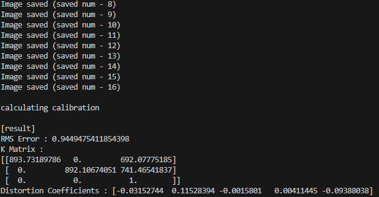
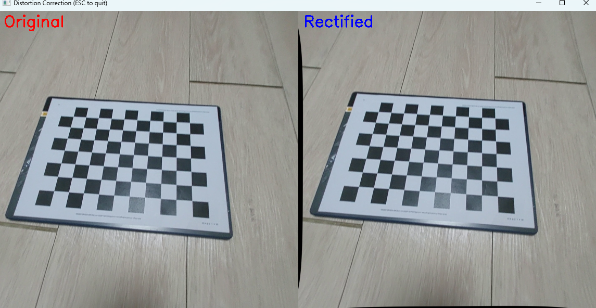
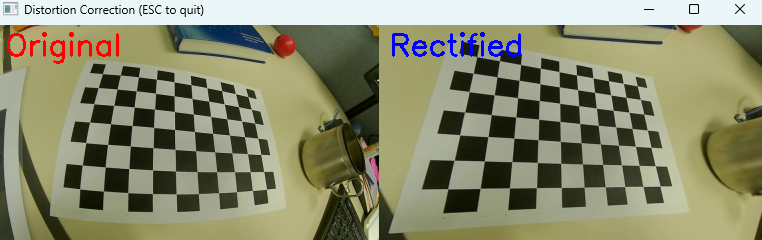

# Camera Calibration & distortion correction

## 개요

OpenCV를 활용하여 카메라의 내부 파라미터(Intrinsic Parameters)를 산출(CAM_calib.py)
산출된 데이터를 바탕으로 렌즈의 기하학적 왜곡을 제거(CAM_dist_cor.py)

---

## Demo

내부 파라미터 산출

Original vs Rectified

---

## 동작 과정 

1. 캘리브레이션 이미지 수집 (CAM_calib.py)
   - 촬영된 체스보드 영상(chessboard_video.mp4)을 프레임 단위로 재생
   - 사용자가 원하는 프레임을 선택하여 'cv.findChessboardCorners'를 통해 10x7 패턴의 2D 코너점(Image Points)을 추출
   - 실제 체스보드 칸의 크기(0.025m)를 반영하여 3D 공간 좌표(Object Points)를 생성

2. 카메라 파라미터 산출
   - 수집된 2D-3D 매칭 데이터를 'cv.calibrateCamera' 함수에 입력하여 카메라 행렬(K)과 왜곡 계수(dist)를 산출, 'calib_result.npz'로 저장

3. 왜곡 보정 적용 (CAM_dist_cor.py)
   - 저장된 파라미터를 로드하고, 'cv.initUndistortRectifyMap'으로 픽셀 매핑 정보(map1, map2)를 1회 연산하여 캐싱
   - 'cv.remap'을 사용하여 매 프레임 실시간으로 왜곡을 보정하고 원본 프레임과 비교 출력

---

### Calibration Results

**RMSE (Root Mean Square Error)**
0.9449475411854398RMSE 값이 1.0 미만으로 산출, 매우 높은 신뢰도의 캘리브레이션이 이루어졌음을 확인

**Intrinsic Parameters**
$$K = \begin{bmatrix} 893.73 & 0 & 692.07 \\ 0 & 892.10 & 741.46 \\ 0 & 0 & 1 \end{bmatrix}$$
Focal Length ($f_x, f_y$): 893.73, 892.10
Principal Point ($c_x, c_y$): 692.07, 741.46

**Distortion Coefficients**
[-0.03152744, 0.11528394, -0.0015801, 0.00411445, -0.09388038]

---

## 결론

내부 데이터 산출 결과의 신뢰도는 높게 나오나, (가지고있는 장비의 한계로...)스마트폰 카메라 영상의 경우 기기 내부 ISP(Image Signal Processor)에서 이미 촬영된 영상이 자체적으로 보정되어있어 오히려 왜곡된 영상을 만들게 됨.

알고리즘 자체의 유효성을 검증하기 위해 실제 방사왜곡이 뚜렷하게 존재하는 레퍼런스 데이터(mint-lab github)를 사용하여 교차 검증을 진행했고,  그 결과(아래 스크린샷 참고) 곡선으로 휘어져 있던 체스판의 격자가 완벽한 일직선으로 보정되는 것을 확인.

---

## screenshots

내부 파라미터 산출

Original vs Rectified

add.) video from 'https://github.com/mint-lab/3dv_tutorial/blob/master/data/chessboard.avi'
 

---

##  References

  * Course : Geometric Image Formation (Prof. Sunglok Choi / https://github.com/mint-lab/)
  * Dataset : Personal Smartphone Camera & Video from https://github.com/mint-lab/
  * Algorithm : Zhang's Method (OpenCV `calibrateCamera`)
